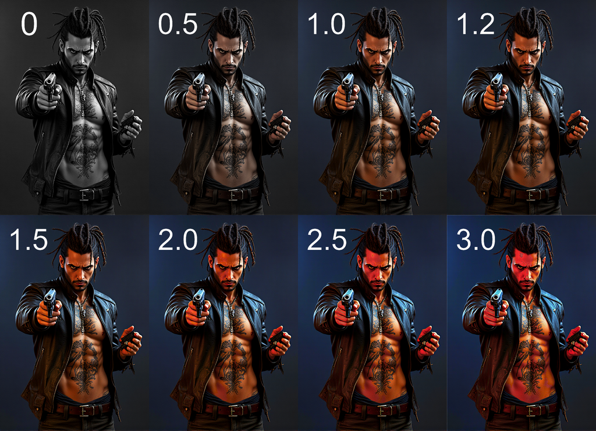

# 🦊 RaykoStudio Saturation Switch Node for ComfyUI  
**Professional image saturation control with artifact and highlight protection.**  

  

---

## 🔥 Features  

- **Smooth adjustment** with 0.05 steps  
- **Smart boosting** without overexposure  
- **Artifact protection** even at extreme values  
- **Batch processing** optimized  
- **Supports**: Windows/Linux · Python 3.11+ · PyTorch 2.0+  

---  

## 🛠 Installation  

- Clone repository to `ComfyUI/custom_nodes/` folder:  
```
git clone https://github.com/Raykosan/ComfyUI_RaykoStudio.git  

```
Restart ComfyUI  

- Copy RaykoStudio_Nodes folder to: ComfyUI/custom_nodes/  

Restart ComfyUI

- You can install this node using the ComfyUI_Manager  

## 🎛 Usage  

🦊 RS Safe Saturation  
| Range      | Processing Type               | Use Case                     |
|------------|-------------------------------|-----------------------------|
| 0.0-0.9    | Toning/desaturation           | Gradual color removal       |
| 1.0-1.3    | Natural enhancement           | Recommended range           |
| 1.3-2.0    | Vibrant artistic effects      | Stylization                 |
| 2.0-3.0    | Maximum saturation            | Cinematic effects           |

## ⚙️ Technical Details  

Algorithm workflow:  

Luminance space conversion  

Non-linear adjustment:  
Values <1.0: Linear interpolation  
Values >1.0: Adaptive S-curve  

Auto highlight recovery  

Recommended settings:  
| Intensity  | Effect                          |
|------------|---------------------------------|
| 0.0-0.9    | Toning/desaturation             |
| 1.0-1.3    | Natural enhancement (recommended) |
| 1.3-2.0    | Vibrant artistic effects        |
| 2.0-3.0    | Cinematic saturation           |
	
## 📜 License  

MIT License. Free for commercial use.  

## 🤝 Support  

Report issues or suggest improvements:  
[Create a GitHub issue](https://github.com/Raykosan/RaykoStudio-SaturationNode/issues)  

---  

> "The best saturation is the one you don’t notice" © RaykoStudio 2025
